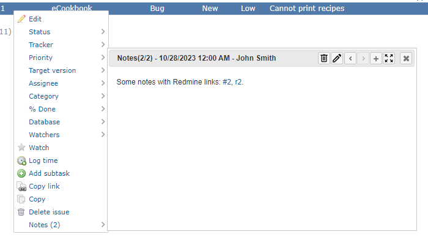
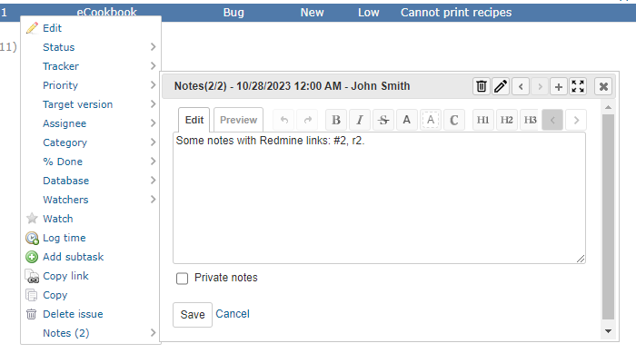

# Redmine Issue Notes On Context Menu
This is a plugin for Redmine.  
This plugin add a menu item to the existing context menu to display the issue notes dialog.  
The dialog has `edit`, `delete` and `add` capabilities.  

## Images
### View mode


### Edit mode


## Supported Redmine Versions
Only Redmine `5.0.5` has been checked. Other versions have not been checked.

## Installation
### When using git

1. Clone this repository to your Redmine plugins directory.
     ```
     cd [YOUR_REDMINE_DIRECTORY]/plugins
     git clone https://github.com/sk-ys/redmine_issue_notes_on_context_menu.git
     ```

2. Restart Redmine.

### When not using git

1. Download zip file from the [release page](https://github.com/sk-ys/redmine_issue_notes_on_context_menu/releases) or the [latest main repository](https://github.com/sk-ys/redmine_issue_notes_on_context_menu/archive/refs/heads/main.zip).

2. Extract the ZIP file to your Redmine plugins directory. The name of the unzipped directory must be `redmine_issue_notes_on_context_menu`.

3. Restart Redmine.


## Using Libraries
### Google Material Symbols
This product includes icons from the Google Material Symbols, which are licensed under the Apache License 2.0.  
https://fonts.google.com/icons
